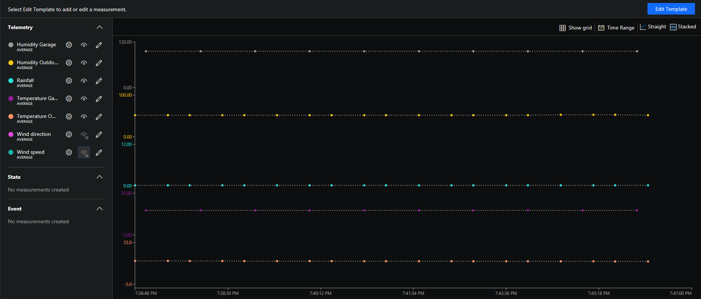
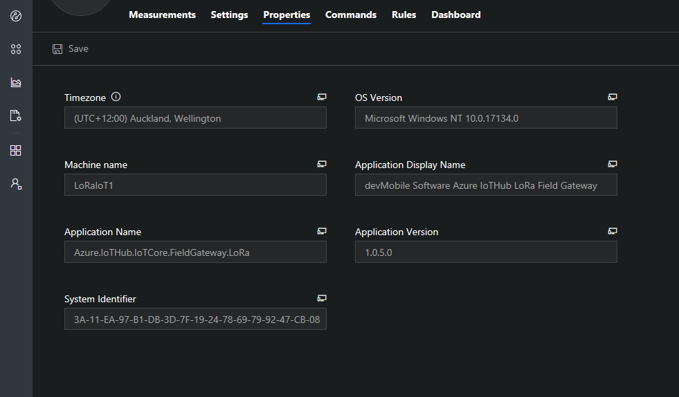
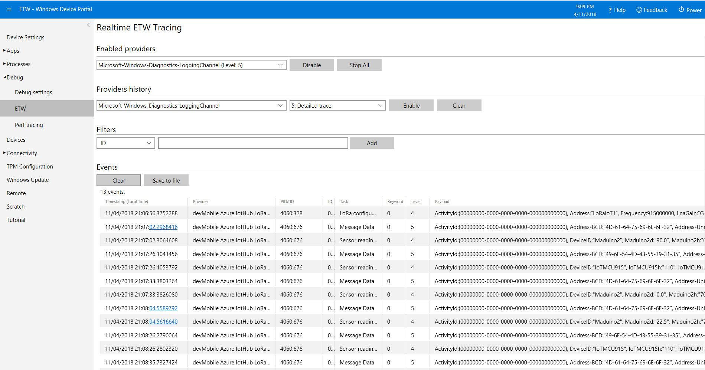
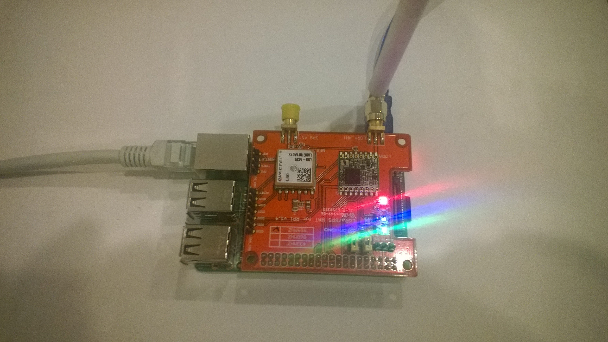
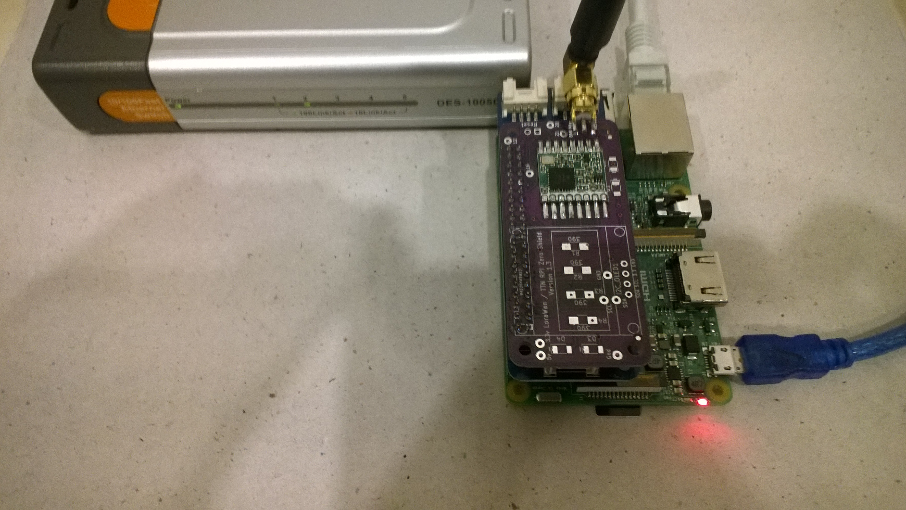
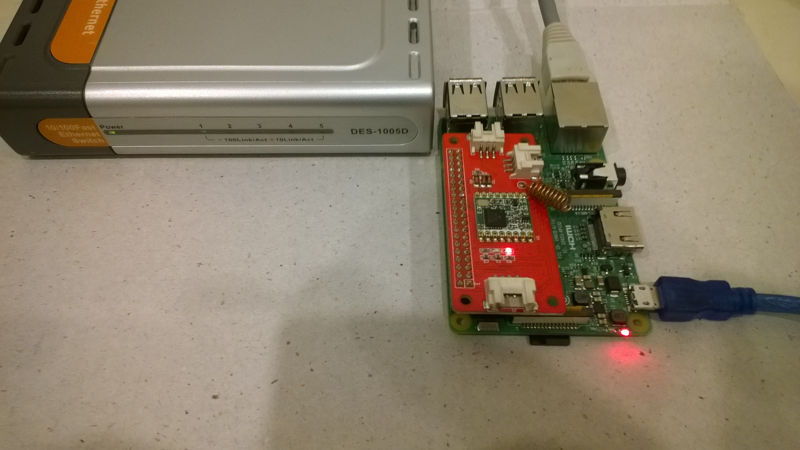
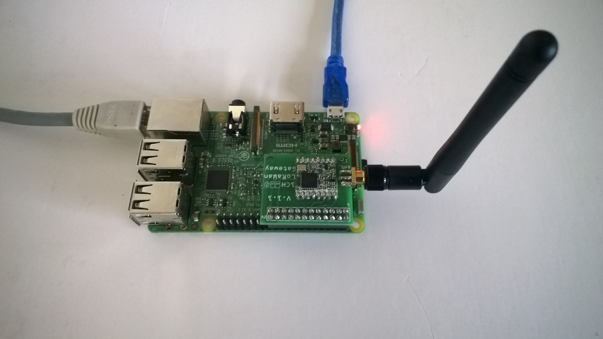
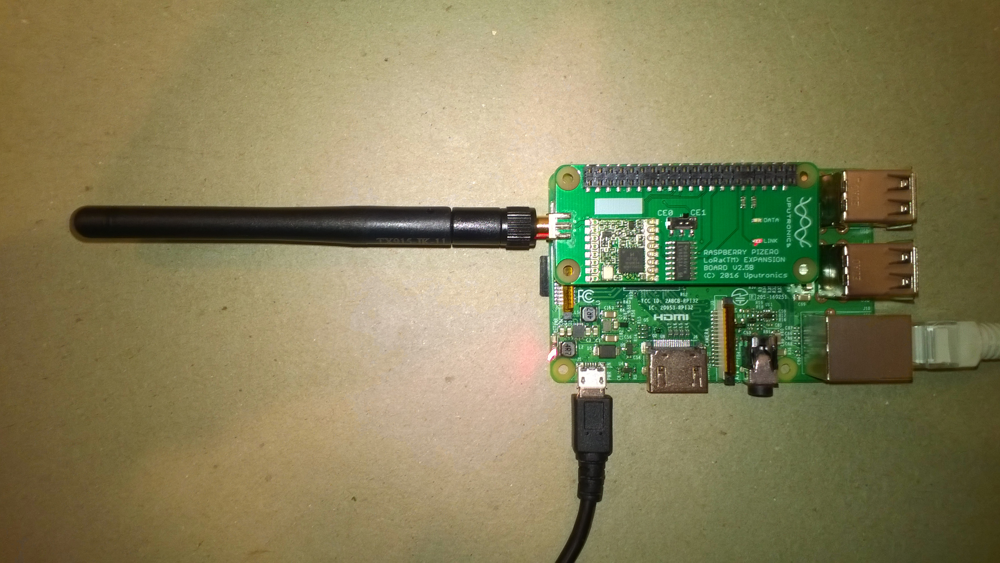
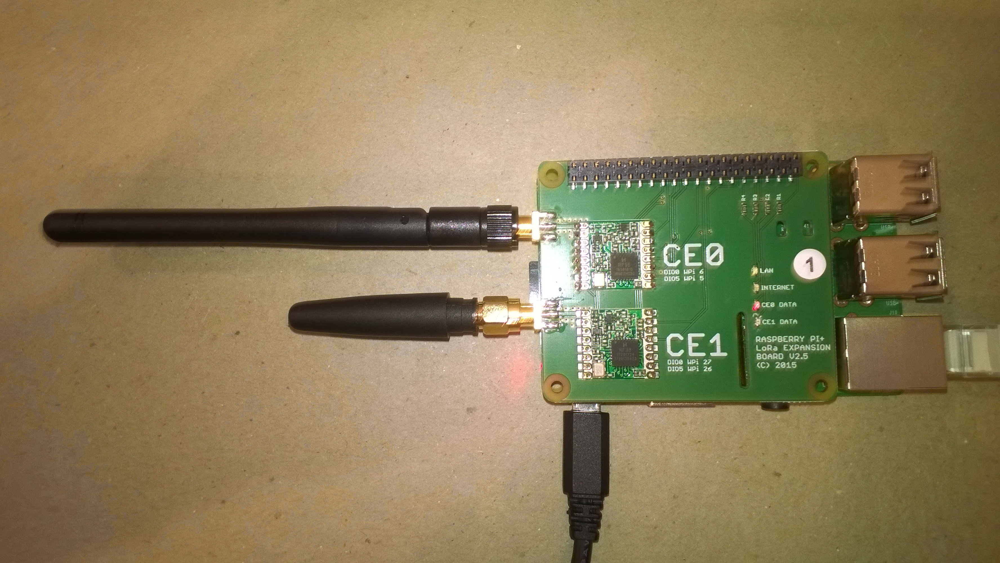
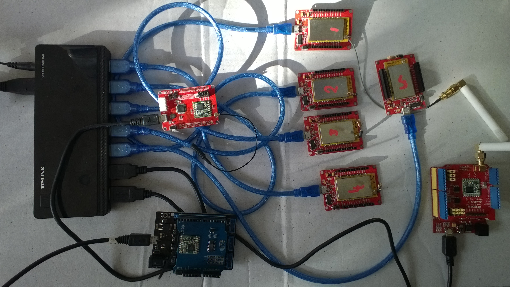

# Azure IoTHub Windows IoTCore LoRa FieldGateway 
AzureIoT Hub Windows 10 IotCore Field Gateway for LoRa capable devices

A Windows 10 IoT Core application based on my [@RFM9X Library](https://github.com/KiwiBryn/RFM9XLoRa-NetMF) for uploading telemetry data from RFM9X/SX127X equipped devices to an [@Azure IoT Hub](https://azure.microsoft.com/en-us/services/iot-hub/) or [@Azure IoT Central](https://azure.microsoft.com/en-us/services/iot-central/)

The field gateway will upload data to Azure IoT Hubs or Azure IoT Central


It has device properties for debugging and support


The application logs data to ETW for debugging and support


The field gateway currently supports these shields

[@Dragino](http://www.dragino.com/products/lora/item/106-lora-gps-hat.html)


[@ElectronicTricks](https://www.tindie.com/products/electronictrik/loralorawan-shield-for-raspberry-pi-zero-and-pi3)


[@Elecrow](https://www.elecrow.com/lora-rfm95-iot-board-for-rpi.html)


[@M2M](https://www.tindie.com/products/m2m/1-channel-lorawan-gateway-shield-for-raspberry-pi)



RPIZero Shield from [@Uputronics](https://store.uputronics.com/index.php?route=product/product&path=61&product_id=91)



RPIPlus Shield from [@Uputronics](https://store.uputronics.com/index.php?route=product/product&path=61&product_id=68)



I have sample client applications which show how to send telemetry from
* [@Arduino](https://blog.devmobile.co.nz/2018/09/05/arduino-payload-addressing-client/) using Dragino, elecrow and MakerFabs shields
* [@Netduino](https://blog.devmobile.co.nz/2018/09/17/netduino-lora-radio-433-868-915-mhz-payload-addressing-client/) using Dragino, elecrow and MakerFabs shields
* [@Maduino](https://blog.devmobile.co.nz/2018/09/15/maduino-lora-radio-868mhz/)
* [@IoTNet](https://blog.devmobile.co.nz/2018/09/20/iot-net-lora-radio-915-mhz-payload-addressing-client/)
* [@IoTMCU915](https://blog.devmobile.co.nz/2018/09/18/lora-radio-node-v1-0-868-915mhz-payload-addressing-client/)
* [@AdaFruit Feather M0](https://blog.devmobile.co.nz/2018/09/23/adafruit-feather-m0-rfm95-lora-radio-payload-addressing-client/)
* [@Elecrow 32u4 with LoRa RFM95 IoT Boatd](https://blog.devmobile.co.nz/2018/09/19/32u4-with-lora-rfm95-iot-board-payload-addressing-client/)
* [@M2M Low power LoRaWan Node Model A328](https://blog.devmobile.co.nz/2018/09/14/low-power-lorawan-node-model-a328-payload-addressing-client/)
* [@M2M Low power LoRaWan Node Model B1284](https://blog.devmobile.co.nz/2018/09/16/low-power-lorawan-node-model-b1248-payload-addressing-client/)
* [@Wisen Whisper Node LoRa](https://blog.devmobile.co.nz/2018/09/24/wisen-whisper-node-lora-915-mhz-payload-addressing-client/)
* [@Dragino LoRa Mini Dev](https://blog.devmobile.co.nz/2018/09/13/dragino-loraminidev-payload-addressing-client/)
* [@SparkFun Pro RF LoRa 915MHz](https://blog.devmobile.co.nz/2018/12/11/sparkfun-pro-rf-lora-915mhz-payload-addressing-client/)
* [@Motenino M0](https://blog.devmobile.co.nz/2018/11/30/moteino-m0-payload-addressing-client/)
* [@Arduino MKR1300 WAN](https://blog.devmobile.co.nz/2018/11/26/arduino-mkr1300-wan-payload-addressing-client/)
* [@Arduino Nano with EasySensors RFM69/95 Shield](https://blog.devmobile.co.nz/2018/11/24/easy-sensors-lora-wireless-field-gateway-arduino-nano-client/)
* [@Wisen Whisper Node-LoRa 915MHz](https://blog.devmobile.co.nz/2018/09/24/wisen-whisper-node-lora-915-mhz-payload-addressing-client/)

An empty configuration file is created the first time the application is run. A minimal configuration file has the device address, the Azure Device Client transport protocol, and the centre frequency.

```Json
{
  "AzureIoTHubDeviceConnectionString": "HostName=saas-iothub-12345678-9012-3456-7890-123456789012.azure-devices.net;DeviceId=b1234567890d;SharedAccessKey=qwertyuiopasdfghjklzxcvbnm1234567890qwertyu=",
  "AzureIoTHubTransportType": "amqp",
  "SensorIDIsDeviceIDSensorID": true,
  "Address": "LoRaIoT1",
  "Frequency": 915000000.0
}
```

The application has been tested with 433MHz and 915MHz devices and stress tested will a number of clients


The "SensorIDIsDeviceIDSensorID" flag concatenates the deviceID and SensorID together so the device can work with Azure IoT Central.

The packet format is detailed in these blog posts [@IoTCore](https://blog.devmobile.co.nz/2018/09/03/rfm9x-iotcore-payload-addressing/) and [@NetMF](https://blog.devmobile.co.nz/2018/09/04/rfm9x-netmf-payload-addressing/). It was intentionally kept simple to make it easier for students to user and debug.

Future proposed enhancements include
  * Device property support (Done Nov 2018)
  * Azure Device provisioning support
  * Cloud to device messaging
  * OTA device provisioning
  * OTA Data encryption
  * Remote settings configuration with Azure IoT Hub device twins
  * Support for other Windows 10 IoT Core devices e.g. Dragon Board 410C
  * Support for other SX127X/RFM9X shields/plates/mezzanine boards
